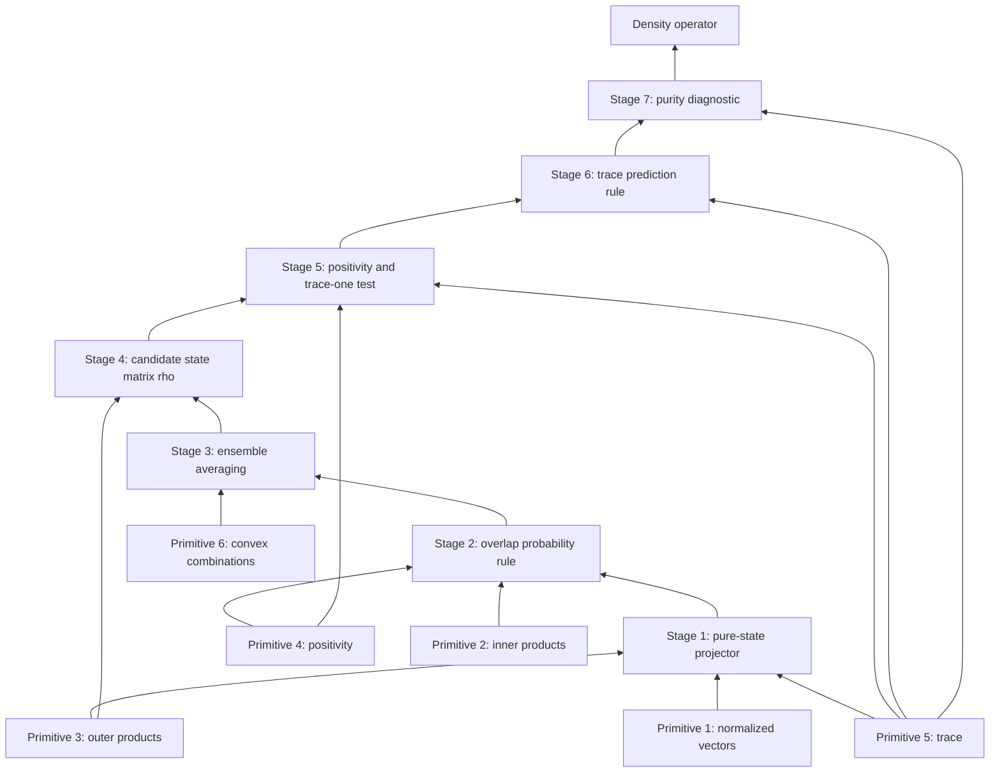

<!-- REVISION NOTES: density_operator_bottom_up_v2.md -->
<!-- Generated by: bottom-up (post-audit patch pass) -->
<!-- Original: density_operator_bottom_up.md (unchanged) -->
<!-- Audit report: density_operator_bottom_up_explanation_audit.md -->
<!--                                                              -->
<!-- CHANGES FROM ORIGINAL:                                       -->
<!-- #1 [moderate] Stage 4 > Motivation — added the predictive-equivalence bridge from ensemble descriptions to the matrix state object -->
<!-- #2 [minor] Section 5 > Formal definition — restated the meaning of positivity locally -->
<!-- ============================================================  -->

## 1. Destination and Why It Matters

Density operator means a positive semidefinite trace-one matrix that packages everything operationally relevant about a finite-dimensional quantum state, including statistical uncertainty.

The pain point it solves is that a single unit vector only describes a perfectly known pure preparation, while real preparation procedures can involve randomness, phase redundancy, and different ensembles that lead to the same observable statistics. We start from normalized vectors, inner products, outer products, positivity, trace, and weighted averages. Then we build rank-one state matrices, probability tests, ensemble averaging, and abstract structural tests, until the density operator becomes the inevitable object that remembers exactly the data measurements can see and forgets the irrelevant preparation details they cannot.

## 2. Foundation Layer (Calculus + Linear Algebra Only)

### Primitive 1: Normalized vectors

What it is: A vector $v\in \mathbb{C}^n$ is normalized when its length is $1$, meaning $v^*v=1$. Here $v^*$ means conjugate transpose.

Why it is load-bearing in this construction: Pure quantum states start as unit vectors, so normalization is the first way to separate valid state descriptions from arbitrary vectors.

Tiny concrete example with numbers: If
$$
v=\frac{1}{\sqrt{2}}\begin{bmatrix}1\\ i\end{bmatrix},
$$
then
$$
v^*v=\frac{1}{2}\begin{bmatrix}1 & -i\end{bmatrix}\begin{bmatrix}1\\ i\end{bmatrix}
=\frac{1}{2}(1+1)=1.
$$

### Primitive 2: Inner products and overlap

What it is: The inner product of $u,v\in \mathbb{C}^n$ is $u^*v$. Its magnitude measures overlap, and $|u^*v|^2$ behaves like a squared alignment.

Why it is load-bearing in this construction: Measurement probabilities will be extracted from squared overlaps, and later the density operator must reproduce those same overlap statistics.

Tiny concrete example with numbers: Let
$$
u=\begin{bmatrix}1\\0\end{bmatrix},
\qquad
v=\frac{1}{\sqrt{2}}\begin{bmatrix}1\\1\end{bmatrix}.
$$
Then
$$
u^*v=\frac{1}{\sqrt{2}},
\qquad
|u^*v|^2=\frac{1}{2}.
$$

### Primitive 3: Outer products and rank-one matrices

What it is: From vectors $u,v$ we can build the matrix $uv^*$. When $u=v$, the matrix $uu^*$ is rank one unless $u=0$.

Why it is load-bearing in this construction: Density operators are built by averaging matrices of the form $vv^*$, so outer products are the atomic pieces of the final object.

Tiny concrete example with numbers: For
$$
u=\frac{1}{\sqrt{2}}\begin{bmatrix}1\\1\end{bmatrix},
$$
we get
$$
uu^*=
\frac{1}{2}
\begin{bmatrix}
1 & 1\\
1 & 1
\end{bmatrix}.
$$

### Primitive 4: Quadratic forms and positivity

What it is: A matrix $M$ is positive semidefinite when $x^*Mx\ge 0$ for every vector $x$.

Why it is load-bearing in this construction: A density operator must assign nonnegative probabilities and expectations to positive tests, so positivity is one of its defining structural constraints.

Tiny concrete example with numbers: Let
$$
M=\begin{bmatrix}2&0\\0&0\end{bmatrix},
\qquad
x=\begin{bmatrix}1\\3\end{bmatrix}.
$$
Then
$$
x^*Mx=\begin{bmatrix}1 & 3\end{bmatrix}
\begin{bmatrix}2&0\\0&0\end{bmatrix}
\begin{bmatrix}1\\3\end{bmatrix}
=\begin{bmatrix}1 & 3\end{bmatrix}\begin{bmatrix}2\\0\end{bmatrix}
=2\ge 0.
$$

### Primitive 5: Trace and cyclic rearrangement

What it is: The trace of a square matrix is the sum of its diagonal entries:
$$
\operatorname{tr}(M)=\sum_i M_{ii}.
$$
For compatible matrices, $\operatorname{tr}(AB)=\operatorname{tr}(BA)$.

Why it is load-bearing in this construction: Trace gives the normalization condition $\operatorname{tr}(\rho)=1$ and later turns matrix products into basis-independent probability and expectation formulas.

Tiny concrete example with numbers: If
$$
M=\begin{bmatrix}2&1\\0&3\end{bmatrix},
\qquad
N=\begin{bmatrix}0&1\\4&0\end{bmatrix},
$$
then
$$
\operatorname{tr}(M)=2+3=5,
$$
and
$$
\operatorname{tr}(MN)=\operatorname{tr}\begin{bmatrix}4&2\\12&0\end{bmatrix}=4
=\operatorname{tr}\begin{bmatrix}0&3\\8&4\end{bmatrix}
=\operatorname{tr}(NM).
$$

### Primitive 6: Weighted averages and convex combinations

What it is: A convex combination is a weighted average
$$
p_1 x_1+\cdots+p_k x_k
$$
with $p_i\ge 0$ and $\sum_i p_i=1$.

Why it is load-bearing in this construction: Mixed states arise by randomly preparing different pure states and averaging their matrix representatives with probabilities.

Tiny concrete example with numbers: If
$$
p_1=\frac14,\quad p_2=\frac34,\quad x_1=2,\quad x_2=6,
$$
then
$$
\frac14\cdot 2+\frac34\cdot 6=\frac12+\frac{18}{4}=5.
$$

## 3. Bottom-Up Thinking Stages

### Stage 1: Package one pure vector as a matrix

Stage output: the rank-one state matrix $P_v=vv^*$ attached to a normalized vector $v$.

**Motivation**:
Bottleneck: A state vector $v$ is useful, but it is not yet a basis-independent matrix object that can be averaged or tested by ordinary matrix rules.
Why-now trigger: Primitive 3 gives a canonical way to convert one vector into one matrix without losing its distinguished direction.
Rejected shortcut: Keep only the list of coordinates of $v$ and hope every later rule can be written coordinate by coordinate.
Stage objective: Build a matrix artifact from one normalized vector that remembers its direction and interacts cleanly with linear algebra operations.
Payoff signal: If the matrix is idempotent and normalized, it will look like a one-state container that can later be averaged.

**Intuition**:
Mental model: $P_v$ is a spotlight pointing along the line spanned by $v$; it keeps the component in that direction and discards the orthogonal part.
Where it fails: A spotlight metaphor hides phase and complex conjugation, so it is intuition only, not the rule itself.

**Construction step**:
Uses: Primitive 1, Primitive 3, Primitive 5.
Assumptions: Let $v\in\mathbb{C}^n$ satisfy $v^*v=1$.
Artifact produced: The rank-one matrix
$$
P_v=vv^*.
$$
Check:
$$
P_v^2=(vv^*)(vv^*)=v(v^*v)v^*=v\cdot 1\cdot v^*=P_v,
$$
and
$$
\operatorname{tr}(P_v)=\operatorname{tr}(vv^*)=\operatorname{tr}(v^*v)=v^*v=1.
$$
Also, for any vector $x$,
$$
P_vx=vv^*x=v(v^*x),
$$
so the output is always a multiple of $v$.

**Worked example**:
Setup: Basis order $(e_1,e_2)$ with
$$
v=e_1=\begin{bmatrix}1\\0\end{bmatrix}.
$$
Compute:
$$
P_v=vv^*=
\begin{bmatrix}1\\0\end{bmatrix}
\begin{bmatrix}1&0\end{bmatrix}
=\begin{bmatrix}1&0\\0&0\end{bmatrix},
$$
and
$$
P_v^2=
\begin{bmatrix}1&0\\0&0\end{bmatrix}
\begin{bmatrix}1&0\\0&0\end{bmatrix}
=\begin{bmatrix}1&0\\0&0\end{bmatrix}=P_v.
$$
Interpret: This matrix keeps the $e_1$ direction and kills the $e_2$ direction.
Common mistake: Treating $v$ itself as the state matrix and forgetting that $v$ is a column while $P_v$ is a full matrix.
Sanity check: The trace is $1$, matching the normalization of $v$.

Setup: Basis order $(e_1,e_2)$ with
$$
v=\frac{1}{\sqrt{2}}\begin{bmatrix}1\\1\end{bmatrix}.
$$
Compute:
$$
P_v=vv^*=
\frac12
\begin{bmatrix}1\\1\end{bmatrix}
\begin{bmatrix}1&1\end{bmatrix}
=\frac12
\begin{bmatrix}1&1\\1&1\end{bmatrix},
$$
and for
$$
x=\begin{bmatrix}2\\0\end{bmatrix},
$$
we get
$$
P_vx=
\frac12
\begin{bmatrix}1&1\\1&1\end{bmatrix}
\begin{bmatrix}2\\0\end{bmatrix}
=\frac12
\begin{bmatrix}2\\2\end{bmatrix}
=\begin{bmatrix}1\\1\end{bmatrix}.
$$
Interpret: The input vector is replaced by its component along the line spanned by $(1,1)$.
Common mistake: Forgetting the factor $\frac12$ and writing the projector as the all-ones matrix.
Sanity check: Applying the projector again leaves the output unchanged because $P_v^2=P_v$.

**What this unlocks next**:
Remaining gap: We have a matrix for one pure vector, but we still need a rule that converts that matrix into probabilities for concrete tests.
Next question: How does $P_v$ encode the chance of passing a one-direction measurement?
Dependency edge: stage_k -> stage_{k+1}: the rank-one matrix becomes a probability calculator through quadratic forms.

### Stage 2: Read probabilities from the rank-one matrix

Stage output: the overlap rule $u^*P_vu=|u^*v|^2$ for a normalized test vector $u$.

**Motivation**:
Bottleneck: Stage 1 gives a matrix artifact, but we do not yet know which scalar prediction it should produce.
Why-now trigger: Primitive 2 says squared overlap is the natural scalar that compares two normalized directions.
Rejected shortcut: Use $u^*v$ directly as the probability, even though it can be complex or negative.
Stage objective: Show that the rank-one matrix reproduces the squared-overlap probability test.
Payoff signal: If one matrix can already answer one-direction questions, averaged matrices may answer averaged preparation questions.

**Intuition**:
Mental model: The test vector $u$ asks, "How much of the state points in my direction?" and the matrix answer is the squared length of that component.
Where it fails: This picture works for yes-no directional tests, but it does not yet explain general observables or mixed preparations.

**Construction step**:
Uses: stage_1, Primitive 2, Primitive 4.
Assumptions: Let $u,v\in\mathbb{C}^n$ be normalized and let $P_v=vv^*$.
Artifact produced: The probability rule
$$
u^*P_vu=|u^*v|^2.
$$
Check:
$$
u^*P_vu=u^*vv^*u=(u^*v)(v^*u).
$$
Since $v^*u=\overline{u^*v}$,
$$
(u^*v)(v^*u)=(u^*v)\overline{u^*v}=|u^*v|^2\ge 0.
$$

**Worked example**:
Setup: Basis order $(e_1,e_2)$ with
$$
v=\frac{1}{\sqrt{2}}\begin{bmatrix}1\\1\end{bmatrix},
\qquad
u=e_1=\begin{bmatrix}1\\0\end{bmatrix}.
$$
Compute:
$$
P_v=\frac12\begin{bmatrix}1&1\\1&1\end{bmatrix},
$$
so
$$
u^*P_vu=
\begin{bmatrix}1&0\end{bmatrix}
\frac12\begin{bmatrix}1&1\\1&1\end{bmatrix}
\begin{bmatrix}1\\0\end{bmatrix}
=\frac12.
$$
Also,
$$
|u^*v|^2=
\left|
\begin{bmatrix}1&0\end{bmatrix}
\frac{1}{\sqrt{2}}\begin{bmatrix}1\\1\end{bmatrix}
\right|^2
=\left|\frac{1}{\sqrt{2}}\right|^2
=\frac12.
$$
Interpret: The state points halfway toward $e_1$, so the test succeeds with probability $\frac12$.
Common mistake: Using $u^Tv$ instead of $u^*v$ when complex entries are present.
Sanity check: The answer lies between $0$ and $1$, as a probability should.

Setup: Basis order $(e_1,e_2)$ with
$$
v=\frac{1}{\sqrt{2}}\begin{bmatrix}1\\ i\end{bmatrix},
\qquad
u=\frac{1}{\sqrt{2}}\begin{bmatrix}1\\ -i\end{bmatrix}.
$$
Compute:
$$
u^*v=
\frac12
\begin{bmatrix}1&i\end{bmatrix}
\begin{bmatrix}1\\ i\end{bmatrix}
=\frac12(1+i^2)
=0,
$$
so
$$
|u^*v|^2=0.
$$
Using the matrix,
$$
P_v=
\frac12
\begin{bmatrix}1&-i\\ i&1\end{bmatrix},
$$
and therefore
$$
u^*P_vu=0.
$$
Interpret: These two directions are orthogonal, so the test never succeeds.
Common mistake: Conjugating the second vector instead of the first when computing $u^*v$.
Sanity check: Orthogonal normalized vectors should give probability $0$.

**What this unlocks next**:
Remaining gap: The rule only covers a source that always prepares the same vector $v$.
Next question: What matrix should represent a preparation device that randomly outputs several pure vectors?
Dependency edge: stage_k -> stage_{k+1}: single-vector probability rules motivate averaging the corresponding matrices.

### Stage 3: Average pure-state matrices for a random preparation

Stage output: the ensemble-average rule $\sum_i p_i u^*P_{v_i}u=u^*(\sum_i p_iP_{v_i})u$.

**Motivation**:
Bottleneck: A pure vector cannot describe a preparation device that sometimes emits one state and sometimes another.
Why-now trigger: Primitive 6 says randomness with known probabilities should appear as a convex combination.
Rejected shortcut: Average the state vectors themselves and hope the resulting vector reproduces the same statistics.
Stage objective: Show that random preparation naturally averages rank-one matrices, not raw vectors.
Payoff signal: If all test probabilities depend only on one averaged matrix, that matrix deserves to become the real state object.

**Intuition**:
Mental model: A random preparation is a lottery over projectors, so the operational data should be the lottery average of those projectors.
Where it fails: This intuition still remembers a particular ensemble description, while the final object should stand on its own.

**Construction step**:
Uses: stage_1, stage_2, Primitive 6.
Assumptions: A device prepares normalized vectors $v_1,\dots,v_k$ with probabilities $p_1,\dots,p_k$ and $\sum_i p_i=1$.
Artifact produced: The averaged testing rule
$$
\sum_{i=1}^k p_i u^*P_{v_i}u
=u^*\left(\sum_{i=1}^k p_iP_{v_i}\right)u.
$$
Check:
$$
\sum_{i=1}^k p_i u^*P_{v_i}u
=\sum_{i=1}^k p_i u^*v_iv_i^*u
=u^*\left(\sum_{i=1}^k p_i v_iv_i^*\right)u.
$$
So averaging probabilities for every test vector $u$ is equivalent to first averaging the rank-one matrices.

**Worked example**:
Setup: Basis order $(e_1,e_2)$ with pure states
$$
v_1=e_1,\qquad v_2=e_2,
$$
probabilities
$$
p_1=p_2=\frac12,
$$
and test vector
$$
u=e_1.
$$
Compute:
$$
\frac12 u^*P_{v_1}u+\frac12 u^*P_{v_2}u
=\frac12\cdot 1+\frac12\cdot 0
=\frac12.
$$
The averaged matrix is
$$
\rho=\frac12
\begin{bmatrix}1&0\\0&0\end{bmatrix}
+\frac12
\begin{bmatrix}0&0\\0&1\end{bmatrix}
=\frac12
\begin{bmatrix}1&0\\0&1\end{bmatrix},
$$
and then
$$
u^*\rho u=
\begin{bmatrix}1&0\end{bmatrix}
\frac12
\begin{bmatrix}1&0\\0&1\end{bmatrix}
\begin{bmatrix}1\\0\end{bmatrix}
=\frac12.
$$
Interpret: Randomly choosing $e_1$ or $e_2$ with equal chance produces the matrix $\frac12 I$.
Common mistake: Replacing the random source by the averaged vector $\frac12(e_1+e_2)$, which gives the wrong probabilities.
Sanity check: The matrix prediction agrees exactly with the average of the pure-state predictions.

Setup: Basis order $(e_1,e_2)$ with
$$
v_+=\frac{1}{\sqrt{2}}\begin{bmatrix}1\\1\end{bmatrix},
\qquad
v_-=\frac{1}{\sqrt{2}}\begin{bmatrix}1\\-1\end{bmatrix},
$$
and probabilities
$$
p_+=p_-=\frac12.
$$
Compute:
$$
P_{v_+}=\frac12\begin{bmatrix}1&1\\1&1\end{bmatrix},
\qquad
P_{v_-}=\frac12\begin{bmatrix}1&-1\\-1&1\end{bmatrix},
$$
so
$$
\rho=\frac12P_{v_+}+\frac12P_{v_-}
=\frac14\begin{bmatrix}1&1\\1&1\end{bmatrix}
+\frac14\begin{bmatrix}1&-1\\-1&1\end{bmatrix}
=\frac12\begin{bmatrix}1&0\\0&1\end{bmatrix}.
$$
Interpret: A very different ensemble gives exactly the same averaged matrix $\frac12 I$ as the first example.
Common mistake: Assuming different state-preparation stories must produce different state objects.
Sanity check: The cross terms cancel, leaving the same test statistics as the first mixed preparation.

**What this unlocks next**:
Remaining gap: We have an averaged matrix, but we have not yet named it as the primary state object or checked what irrelevant details it forgets.
Next question: Why should the averaged matrix itself, rather than the whole ensemble description, be treated as the state?
Dependency edge: stage_k -> stage_{k+1}: ensemble averaging singles out one matrix as the operational state carrier.

### Stage 4: Promote the averaged matrix to the state object

Stage output: the candidate state matrix $\rho=\sum_i p_i v_iv_i^*$ with phase redundancy removed.

**Motivation**:
Bottleneck: Stage 3 still starts from an ensemble description $(p_i,v_i)$ instead of a standalone matrix object.
Why-now trigger: The two worked examples in Stage 3 already show that distinct ensembles can produce the same averaged matrix.
The key bridge is predictive equivalence: Stage 3 showed that every one-direction test depends only on the averaged matrix, not on the labels of the lottery that produced it. Once two preparation stories give the same matrix and the same test outcomes, the matrix is the object with physical meaning and the ensemble is only one possible recipe.
Rejected shortcut: Record the full list of probabilities and vectors as the fundamental state and treat the matrix as optional bookkeeping.
Stage objective: Define the matrix candidate $\rho$ itself and verify that it forgets global phase, which no measurement should detect.
Payoff signal: If $\rho$ is phase-insensitive and ensemble-compressing, it is a better state object than the raw preparation story.

**Intuition**:
Mental model: $\rho$ is a summary ledger of all testable directional information, stripped of the labels that only describe how the source was assembled.
Where it fails: A ledger metaphor does not by itself tell us which matrices are admissible; we still need structural tests.

**Construction step**:
Uses: stage_3, Primitive 3, Primitive 6.
Assumptions: Let
$$
\rho=\sum_{i=1}^k p_i v_iv_i^*
$$
with $p_i\ge 0$, $\sum_i p_i=1$, and each $v_i$ normalized.
Artifact produced: The ensemble-compressed matrix $\rho$.
Check:
$$
\rho^*=
\left(\sum_{i=1}^k p_i v_iv_i^*\right)^*
=\sum_{i=1}^k p_i (v_iv_i^*)^*
=\sum_{i=1}^k p_i v_iv_i^*
=\rho.
$$
Also, if $w=e^{i\theta}v$, then
$$
ww^*=(e^{i\theta}v)(e^{i\theta}v)^*
=e^{i\theta}vv^*e^{-i\theta}
=vv^*.
$$
So global phase changes in the vectors do not change the matrix state object.

**Worked example**:
Setup: Basis order $(e_1,e_2)$ with
$$
v=\frac{1}{\sqrt{2}}\begin{bmatrix}1\\ i\end{bmatrix},
\qquad
w=i v=\frac{1}{\sqrt{2}}\begin{bmatrix}i\\ -1\end{bmatrix}.
$$
Compute:
$$
P_v=
\frac12
\begin{bmatrix}1&-i\\ i&1\end{bmatrix},
$$
while
$$
P_w=
\frac12
\begin{bmatrix}i\\-1\end{bmatrix}
\begin{bmatrix}-i&-1\end{bmatrix}
=\frac12
\begin{bmatrix}1&-i\\ i&1\end{bmatrix}
=P_v.
$$
Interpret: Multiplying a pure vector by a global phase changes the column but not the state matrix.
Common mistake: Treating $v$ and $iv$ as different physical states because the vectors look different entry by entry.
Sanity check: The projector is unchanged, so every test probability from Stage 2 is unchanged.

Setup: Basis order $(e_1,e_2)$ with ensemble data
$$
p_1=\frac34,\quad v_1=e_1,\qquad p_2=\frac14,\quad v_2=e_2.
$$
Compute:
$$
\rho=\frac34
\begin{bmatrix}1&0\\0&0\end{bmatrix}
+\frac14
\begin{bmatrix}0&0\\0&1\end{bmatrix}
=\begin{bmatrix}\frac34&0\\0&\frac14\end{bmatrix},
$$
and
$$
\rho^*=
\begin{bmatrix}\frac34&0\\0&\frac14\end{bmatrix}
=\rho.
$$
Interpret: The whole ensemble has been compressed into one self-adjoint matrix.
Common mistake: Thinking the state object must store the labels “first outcome” and “second outcome” separately.
Sanity check: The two main entries already add to $1$, hinting at a normalization rule we can isolate next.

**What this unlocks next**:
Remaining gap: Not every self-adjoint matrix should qualify as a state, so we need precise structural conditions.
Next question: Which abstract matrix properties characterize exactly the matrices that come from state ensembles?
Dependency edge: stage_k -> stage_{k+1}: the ensemble-compressed matrix needs intrinsic tests for validity.

### Stage 5: Isolate the intrinsic validity tests

Stage output: the checklist “$\rho$ is positive semidefinite and $\operatorname{tr}(\rho)=1$.”

**Motivation**:
Bottleneck: Stage 4 gives a candidate matrix, but it still depends on remembering how we built it from pure vectors.
Why-now trigger: Primitive 4 and Primitive 5 are exactly the matrix tools that can certify nonnegative probabilities and correct normalization.
Rejected shortcut: Accept every self-adjoint trace-one matrix without checking whether it can produce negative quadratic-form values.
Stage objective: Extract the ensemble-independent tests that any admissible state matrix must satisfy.
Payoff signal: Once these tests are explicit, we can define the state object abstractly without mentioning an ensemble.

**Intuition**:
Mental model: Positivity says the matrix never assigns negative weight to a directional test, and trace one says the total weight is normalized.
Where it fails: This intuition does not yet explain how to compute general observable averages; it only tells us which matrices are allowed.

**Construction step**:
Uses: stage_4, Primitive 4, Primitive 5, Primitive 6.
Assumptions: Let
$$
\rho=\sum_{i=1}^k p_i v_iv_i^*
$$
with each $v_i$ normalized.
Artifact produced: The intrinsic conditions
$$
\rho\ge 0,
\qquad
\operatorname{tr}(\rho)=1.
$$
Check:
$$
x^*\rho x
=x^*\left(\sum_{i=1}^k p_i v_iv_i^*\right)x
=\sum_{i=1}^k p_i x^*v_iv_i^*x
=\sum_{i=1}^k p_i |v_i^*x|^2
\ge 0
$$
for every vector $x$, so $\rho$ is positive semidefinite. Also,
$$
\operatorname{tr}(\rho)
=\operatorname{tr}\left(\sum_{i=1}^k p_i v_iv_i^*\right)
=\sum_{i=1}^k p_i \operatorname{tr}(v_iv_i^*)
=\sum_{i=1}^k p_i v_i^*v_i
=\sum_{i=1}^k p_i
=1.
$$

**Worked example**:
Setup: Basis order $(e_1,e_2)$ with
$$
\rho=
\begin{bmatrix}
0.7&0\\
0&0.3
\end{bmatrix},
\qquad
x=\begin{bmatrix}2\\-1\end{bmatrix}.
$$
Compute:
$$
x^*\rho x=
\begin{bmatrix}2&-1\end{bmatrix}
\begin{bmatrix}0.7&0\\0&0.3\end{bmatrix}
\begin{bmatrix}2\\-1\end{bmatrix}
=\begin{bmatrix}2&-1\end{bmatrix}
\begin{bmatrix}1.4\\-0.3\end{bmatrix}
=3.1\ge 0,
$$
and
$$
\operatorname{tr}(\rho)=0.7+0.3=1.
$$
Interpret: This matrix passes the abstract validity test.
Common mistake: Checking positivity only on basis vectors and assuming that is automatically enough without justification.
Sanity check: The eigenvalues are $0.7$ and $0.3$, both nonnegative and summing to $1$.

Setup: Basis order $(e_1,e_2)$ with
$$
M=
\begin{bmatrix}
1.1&0\\
0&-0.1
\end{bmatrix},
\qquad
x=e_2=\begin{bmatrix}0\\1\end{bmatrix}.
$$
Compute:
$$
\operatorname{tr}(M)=1.1+(-0.1)=1,
$$
but
$$
x^*Mx=
\begin{bmatrix}0&1\end{bmatrix}
\begin{bmatrix}1.1&0\\0&-0.1\end{bmatrix}
\begin{bmatrix}0\\1\end{bmatrix}
=-0.1<0.
$$
Interpret: Trace one alone is not enough; negativity in a quadratic form disqualifies the matrix.
Common mistake: Thinking normalization is the only requirement because probabilities must add to one.
Sanity check: The negative entry on the main line already warns that some direction will produce a negative value.

**What this unlocks next**:
Remaining gap: We can recognize valid state matrices, but we still need a single basis-independent rule for extracting probabilities and expectation values from them.
Next question: Once $\rho$ is valid, how do we compute the predicted number for a measurement test or observable?
Dependency edge: stage_k -> stage_{k+1}: positivity and trace normalization prepare the trace formula for probabilities and expectations.

### Stage 6: Express probabilities and expectations with trace

Stage output: the rules $\operatorname{tr}(\rho P_u)$ for one-direction tests and $\operatorname{tr}(\rho A)$ for self-adjoint observables $A$.

**Motivation**:
Bottleneck: Stage 5 says which matrices count as states, but it does not yet tell us how the state produces measurable numbers.
Why-now trigger: Primitive 5 gives a basis-independent scalar extractor, and Stage 3 already showed that averaged pure-state predictions should combine linearly.
Rejected shortcut: Keep returning to the hidden ensemble $(p_i,v_i)$ every time we want one expectation value.
Stage objective: Derive a direct formula from $\rho$ alone for directional probabilities and for expectations of self-adjoint matrices.
Payoff signal: If every measurable prediction comes from $\rho$ by trace, then $\rho$ is fully operational.

**Intuition**:
Mental model: The trace pairs the state matrix with the test matrix and compresses their interaction to one scalar.
Where it fails: Pairing by trace is not arbitrary bookkeeping; it works only because of the structural properties built earlier.

**Construction step**:
Uses: stage_2, stage_3, stage_5, Primitive 5.
Assumptions: Let $P_u=uu^*$ for a normalized test vector $u$. Let $A=A^*$ be a self-adjoint matrix, meaning $A$ equals its conjugate transpose. Let
$$
\rho=\sum_{i=1}^k p_i v_iv_i^*.
$$
Artifact produced: The probability and expectation formulas
$$
\operatorname{Prob}(u\text{-test passes})=\operatorname{tr}(\rho P_u),
\qquad
\mathbb{E}_\rho[A]=\operatorname{tr}(\rho A).
$$
Check:
$$
\operatorname{tr}(\rho P_u)
=\operatorname{tr}\left(\sum_{i=1}^k p_i v_iv_i^*uu^*\right)
=\sum_{i=1}^k p_i \operatorname{tr}(v_iv_i^*uu^*).
$$
Using cyclicity,
$$
\operatorname{tr}(v_iv_i^*uu^*)
=\operatorname{tr}(u^*v_iv_i^*u)
=|u^*v_i|^2,
$$
so
$$
\operatorname{tr}(\rho P_u)=\sum_{i=1}^k p_i |u^*v_i|^2.
$$
Similarly,
$$
\operatorname{tr}(\rho A)
=\operatorname{tr}\left(\sum_{i=1}^k p_i v_iv_i^*A\right)
=\sum_{i=1}^k p_i \operatorname{tr}(v_i^*Av_i)
=\sum_{i=1}^k p_i v_i^*Av_i.
$$

**Worked example**:
Setup: Basis order $(e_1,e_2)$ with
$$
\rho=
\begin{bmatrix}
0.7&0\\
0&0.3
\end{bmatrix},
\qquad
u=e_1,
\qquad
P_u=
\begin{bmatrix}
1&0\\
0&0
\end{bmatrix}.
$$
Compute:
$$
\rho P_u=
\begin{bmatrix}
0.7&0\\
0&0.3
\end{bmatrix}
\begin{bmatrix}
1&0\\
0&0
\end{bmatrix}
=
\begin{bmatrix}
0.7&0\\
0&0
\end{bmatrix},
$$
so
$$
\operatorname{tr}(\rho P_u)=0.7.
$$
Also,
$$
u^*\rho u=
\begin{bmatrix}1&0\end{bmatrix}
\begin{bmatrix}
0.7&0\\
0&0.3
\end{bmatrix}
\begin{bmatrix}1\\0\end{bmatrix}
=0.7.
$$
Interpret: The state assigns probability $0.7$ to passing the $e_1$ test.
Common mistake: Multiplying the matrices in the wrong order and then forgetting that the trace removes the ordering issue.
Sanity check: The answer matches the first main entry because the test asks for the $e_1$ population.

Setup: Basis order $(e_1,e_2)$ with
$$
\rho=\frac12
\begin{bmatrix}
1&0\\
0&1
\end{bmatrix},
\qquad
A=
\begin{bmatrix}
1&0\\
0&-1
\end{bmatrix}.
$$
Compute:
$$
\rho A=
\frac12
\begin{bmatrix}
1&0\\
0&1
\end{bmatrix}
\begin{bmatrix}
1&0\\
0&-1
\end{bmatrix}
=\frac12
\begin{bmatrix}
1&0\\
0&-1
\end{bmatrix},
$$
and then
$$
\operatorname{tr}(\rho A)=\frac12(1)+\frac12(-1)=0.
$$
Interpret: The maximally mixed qubit has zero average for the observable that distinguishes $e_1$ from $e_2$.
Common mistake: Thinking cross terms must appear for a trace formula to be meaningful.
Sanity check: Equal weight on eigenvalues $+1$ and $-1$ should cancel to $0$.

**What this unlocks next**:
Remaining gap: We can now compute every basic prediction from $\rho$, but we still need an internal test that separates pure states from genuinely mixed ones.
Next question: How can we tell from the matrix alone whether the state comes from one vector or from a nontrivial ensemble?
Dependency edge: stage_k -> stage_{k+1}: the operational trace rule motivates an internal purity diagnostic.

### Stage 7: Distinguish pure and mixed states internally

Stage output: the purity diagnostic “pure means $\rho^2=\rho$ and mixed means typically $\operatorname{tr}(\rho^2)<1$.”

**Motivation**:
Bottleneck: The final state object $\rho$ deliberately forgets the original ensemble, so we need a matrix-internal way to recognize whether it is still pure.
Why-now trigger: Stage 1 already showed that rank-one projectors satisfy $P_v^2=P_v$, suggesting idempotence as the pure-state signature.
Rejected shortcut: Call every trace-one matrix “pure” unless we explicitly know a random preparation story behind it.
Stage objective: Derive a criterion that reads purity directly from the matrix.
Payoff signal: Once purity is visible in $\rho$ itself, the full density-operator concept is complete.

**Intuition**:
Mental model: A pure state is sharp enough that projecting it against itself changes nothing, while a mixed state is spread out and becomes “smaller” under squaring.
Where it fails: Squaring matrices is not the same as squaring probabilities entrywise, so the picture must be checked algebraically.

**Construction step**:
Uses: stage_1, stage_5, stage_6, Primitive 5.
Assumptions: Let $\rho$ be a valid state matrix.
Artifact produced: The purity tests
$$
\rho \text{ pure } \Longleftrightarrow \rho^2=\rho,
\qquad
\operatorname{tr}(\rho^2)=1 \text{ for pure states}.
$$
Check:
$$
\text{if }\rho=P_v=vv^*,
\quad
\rho^2=(vv^*)(vv^*)=v(v^*v)v^*=vv^*=\rho.
$$
Then
$$
\operatorname{tr}(\rho^2)=\operatorname{tr}(\rho)=1.
$$
For a diagonal mixed state
$$
\rho=\operatorname{diag}(\lambda_1,\dots,\lambda_n),
\quad
\lambda_i\ge 0,
\quad
\sum_i \lambda_i=1,
$$
we get
$$
\operatorname{tr}(\rho^2)=\sum_i \lambda_i^2,
$$
which is strictly less than $1$ unless exactly one $\lambda_i$ equals $1$ and the rest are $0$.

**Worked example**:
Setup: Basis order $(e_1,e_2)$ with the pure-state matrix
$$
\rho=
\begin{bmatrix}
1&0\\
0&0
\end{bmatrix}.
$$
Compute:
$$
\rho^2=
\begin{bmatrix}
1&0\\
0&0
\end{bmatrix}
\begin{bmatrix}
1&0\\
0&0
\end{bmatrix}
=
\begin{bmatrix}
1&0\\
0&0
\end{bmatrix}
=\rho,
$$
and
$$
\operatorname{tr}(\rho^2)=1.
$$
Interpret: This matrix is pure because it is exactly the projector onto one direction.
Common mistake: Thinking idempotence is automatically true for every positive matrix.
Sanity check: The rank is $1$, matching the one-direction picture from Stage 1.

Setup: Basis order $(e_1,e_2)$ with the mixed-state matrix
$$
\rho=\frac12
\begin{bmatrix}
1&0\\
0&1
\end{bmatrix}.
$$
Compute:
$$
\rho^2=
\frac14
\begin{bmatrix}
1&0\\
0&1
\end{bmatrix},
$$
so
$$
\rho^2\neq \rho,
\qquad
\operatorname{tr}(\rho^2)=\frac14+\frac14=\frac12.
$$
Interpret: The maximally mixed qubit is not pure because its weight is split across two directions.
Common mistake: Expecting trace one to force idempotence.
Sanity check: Since the eigenvalues are $\frac12,\frac12$, their squares sum to $\frac12<1$.

**What this unlocks next**:
Remaining gap: No structural gap remains; we can now state the full concept cleanly.
Next question: How should the final definition package positivity, trace one, and the pure-versus-mixed distinction in one compact statement?
Dependency edge: stage_k -> destination: purity diagnostics complete the density-operator concept.

## 4. Assembly Snapshot

Dependency chain:

normalized vectors + inner products + outer products + positivity + trace + convex combinations -> pure-state projectors -> overlap probabilities -> ensemble averaging -> state matrix $\rho$ -> positivity and trace-one tests -> trace prediction rule -> purity diagnostic -> density operator

## 5. Final Concept/Theorem Statement

Formal definition: In a finite-dimensional complex inner-product space, a density operator is a linear operator $\rho$ such that
$$
\rho\ge 0
\qquad\text{and}\qquad
\operatorname{tr}(\rho)=1.
$$
Here $\rho\ge 0$ means $x^*\rho x\ge 0$ for every vector $x$, so the operator never assigns a negative quadratic-form value to any direction.
Equivalently, in matrix language, it is a positive semidefinite trace-one matrix. A pure state is the special case $\rho=vv^*$ for some normalized vector $v$; otherwise the state is mixed.

Near-miss/non-example: The matrix
$$
\begin{bmatrix}
1.1&0\\
0&-0.1
\end{bmatrix}
$$
has trace $1$ but is not a density operator because it fails positivity: the vector $e_2$ gives the negative quadratic form value $e_2^*\rho e_2=-0.1$.

Wrong mental model: “A density operator is just a probability vector written as a matrix.”

Correction: Only some density operators are diagonal in a chosen basis. Off-diagonal entries can matter because they encode coherence relative to that basis. The matrix is not merely a list of classical probabilities; it is the linear-algebra object that reproduces all trace-based predictions.

## 6. How the Thinking Process Could Have Invented It

The invention path starts with an overly simple success: one normalized vector already predicts one-direction measurement probabilities through squared overlap. That suggests turning the vector into the projector $vv^*$, because matrices are easier to manipulate, average, and compare than raw columns. The next limitation appears immediately: real preparation devices can be random, so a single vector is not enough. The natural response is to average the projectors with the preparation probabilities, producing one matrix that gives the same averaged test outcomes.

A naive attempt then fails: average the vectors instead of the projectors. For the equal random preparation of $e_1$ and $e_2$, the averaged vector $\frac12(e_1+e_2)$ would predict the $e_1$ test probability
$$
\left|
\begin{bmatrix}1&0\end{bmatrix}
\frac12\begin{bmatrix}1\\1\end{bmatrix}
\right|^2
=\frac14,
$$
but the actual random preparation gives
$$
\frac12\cdot 1+\frac12\cdot 0=\frac12.
$$
So vector averaging breaks the operational statistics. That failure forces the matrix average $\rho=\sum_i p_i v_iv_i^*$.

Once the averaged matrix exists, the next natural question is not “where did it come from?” but “which matrices could play this role on their own?” Positivity answers the nonnegativity problem, trace one answers the normalization problem, and cyclic trace identities turn $\rho$ into a prediction rule for tests and observables. The last limitation is internal recognition: after compressing away the ensemble, how do we still spot pure states? Idempotence and $\operatorname{tr}(\rho^2)$ solve that. At that point the density operator is no longer an arbitrary definition; it is the unique matrix-shaped answer to every bottleneck the earlier stages exposed.

## 7. Downstream Growth from the Same Elementary Ideas

Name: Partial trace
Foundation ideas reused: Primitive 3, Primitive 5, Stage 4, Stage 6.
Reason it depends: Partial trace keeps the density-operator viewpoint but sums out one subsystem using outer-product structure and trace identities.
Suggested next command: `/bottom-up partial trace`

Name: Quantum channel
Foundation ideas reused: Primitive 3, Primitive 4, Primitive 5, Stage 5, Stage 6.
Reason it depends: Quantum channels are exactly the linear maps that send density operators to density operators while preserving positivity and normalization.
Suggested next command: `/bottom-up quantum channel`

Name: POVM measurement
Foundation ideas reused: Primitive 2, Primitive 4, Primitive 5, Stage 6.
Reason it depends: Generalized measurements extend the trace probability rule from projectors to broader positive operators.
Suggested next command: `/bottom-up POVM`

Name: Von Neumann entropy
Foundation ideas reused: Primitive 5, Stage 5, Stage 7.
Reason it depends: Entropy depends on the eigenvalue spread of a density operator, especially the pure-versus-mixed distinction captured by purity diagnostics.
Suggested next command: `/bottom-up von Neumann entropy`

Name: Bloch sphere for qubits
Foundation ideas reused: Primitive 3, Primitive 4, Primitive 6, Stage 5, Stage 7.
Reason it depends: The Bloch sphere rewrites $2\times 2$ density operators as geometric data constrained by positivity and trace one.
Suggested next command: `/bottom-up Bloch sphere`
