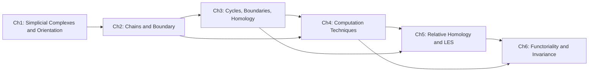

# Simplicial Homology: A Bottom-Up Course

## Course Overview
This course builds simplicial homology as an invented response to concrete counting and shape-distinguishing failures. We begin with combinatorial pieces (vertices, edges, triangles), then formalize oriented chains and boundary operators, and finally construct homology groups as invariants that detect holes while ignoring irrelevant geometric deformations. Each chapter follows a strict bottom-up progression: foundations, staged construction, assembly into formal statements, and an invention narrative that explains why each object had to be created.

## Audience and Prerequisite Assumptions
Target audience: advanced undergraduates, early graduate students, or self-learners in mathematics, computer science, or physics who want algebraic topology from first principles.

Assumed prerequisites:
- Comfort with linear algebra over $\mathbb{Z}$ and basic quotient groups
- Introductory proof literacy (direct proof, contradiction, induction)
- Basic set language (functions, images, preimages)
- Familiarity with geometric intuition for curves, surfaces, and triangulations

Not assumed:
- Prior exposure to homological algebra
- Category theory
- CW complexes or spectral sequences

## Chapter Plan (6 Chapters)

### Chapter 1 - From Shapes to Combinatorial Skeletons
Learning objectives:
- Model geometric spaces by simplicial complexes without losing essential adjacency structure.
- Distinguish abstract simplices from geometric realizations.
- Track orientation choices and their computational consequences.

Prerequisites (chapter dependencies):
- None (entry chapter)

Chapter target concept/theorem:
- Formal notion of simplicial complex, oriented simplex, and simplicial dimension.

Why this chapter is placed here:
- Homology needs a discrete language for spaces before any algebra can be built; this chapter creates the objects that later chapters will algebraize.

### Chapter 2 - Chains and the Boundary Operator as a First Machine
Learning objectives:
- Construct chain groups $C_n(K)$ from oriented simplices.
- Define and compute the boundary map $\partial_n$ with signs.
- Interpret $\partial_n$ as an algebraic encoding of geometric boundary.

Prerequisites (chapter dependencies):
- Chapter 1

Chapter target concept/theorem:
- Definition of simplicial chain complex $(C_n(K), \partial_n)$ and explicit boundary formulas.

Why this chapter is placed here:
- Once simplices are available, the next unavoidable step is an algebraic mechanism that tracks how higher-dimensional pieces are glued along lower-dimensional faces.

### Chapter 3 - Why $\partial^2 = 0$ Forces Homology
Learning objectives:
- Prove $\partial_{n-1}\partial_n = 0$ combinatorially.
- Define cycles $Z_n = \ker \partial_n$ and boundaries $B_n = \operatorname{im}\partial_{n+1}$.
- Build homology groups $H_n(K)=Z_n/B_n$ as quotient corrections to overcounting.

Prerequisites (chapter dependencies):
- Chapters 1-2

Chapter target concept/theorem:
- Simplicial homology groups and the theorem $B_n \subseteq Z_n$.

Why this chapter is placed here:
- The identity $\partial^2=0$ creates the key algebraic tension (many cycles are trivial), and homology is invented precisely to resolve that tension.

### Chapter 4 - Computing Homology in Practice
Learning objectives:
- Compute $H_n$ for basic examples (interval, circle, 2-simplex boundary, sphere triangulations).
- Use matrices and Smith-normal-form-style reasoning over $\mathbb{Z}$ to compute kernels/images.
- Separate connectedness, 1-dimensional holes, and 2-dimensional voids via Betti numbers and torsion cues.

Prerequisites (chapter dependencies):
- Chapters 1-3

Chapter target concept/theorem:
- Workflow theorem: finite simplicial homology is computable from boundary matrices.

Why this chapter is placed here:
- After definitions, students must see that homology is operational and not merely formal; computation consolidates intuition and reveals what the invariant actually captures.

### Chapter 5 - Relative Homology and Exact Sequences as Structural Control
Learning objectives:
- Define relative chains and relative homology $H_n(K,A)$.
- Derive the long exact sequence of a pair in simplicial form.
- Use exactness to infer unknown homology groups from known neighbors.

Prerequisites (chapter dependencies):
- Chapters 1-4

Chapter target concept/theorem:
- Long exact sequence of a simplicial pair $(K,A)$ and connecting morphism intuition.

Why this chapter is placed here:
- Once absolute homology is computable, the next bottleneck is comparison across subspaces; relative homology and exact sequences provide the missing relational machinery.

### Chapter 6 - Functoriality, Invariance, and Bridge to Singular Homology
Learning objectives:
- Define induced maps on homology from simplicial maps.
- State and use simplicial invariance ideas (subdivision and approximation viewpoint).
- Connect simplicial homology to broader algebraic topology workflows (Mayer-Vietoris, singular homology, computational topology).

Prerequisites (chapter dependencies):
- Chapters 1-5

Chapter target concept/theorem:
- Homology as a functorial topological invariant (within simplicial category and toward singular comparison).

Why this chapter is placed here:
- Final chapter explains why earlier constructions matter beyond examples: invariance and morphisms make homology a reusable tool rather than a one-off computation recipe.

## Dependency Graph

## Suggested Reading Order
1. Chapter 1: establish combinatorial language and orientation discipline.
2. Chapter 2: build chain-level machinery and boundary operator fluency.
3. Chapter 3: internalize $\partial^2=0$ and the quotient logic behind $H_n$.
4. Chapter 4: practice full computations until interpretation is automatic.
5. Chapter 5: learn relational tools (relative groups and exact sequences).
6. Chapter 6: consolidate invariance perspective and transition to broader topology.

For learners needing extra reinforcement, revisit Chapter 2 immediately after first reading of Chapter 3, then continue forward.
