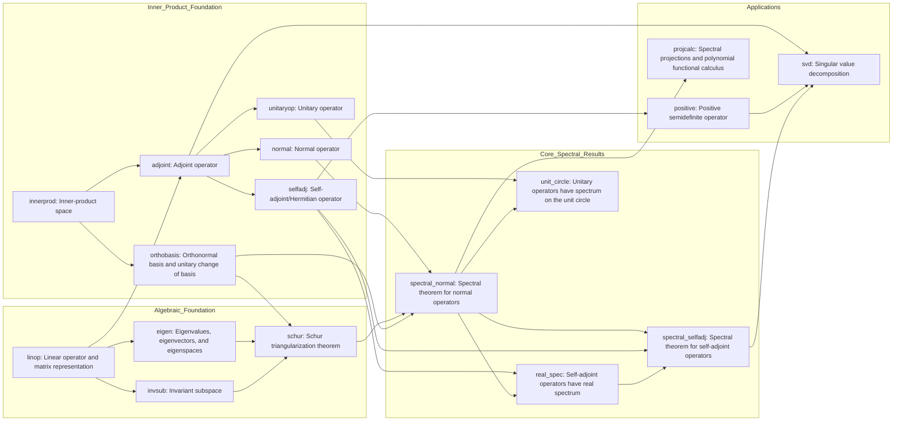

# Spectral Theory in Linear Algebra Dependency Map

## 1) Scope and Inputs

- Input topic: `Spectral theory in linear algebra`
- Source mode: inferred
- Scope choice: this map assumes a canonical finite-dimensional course over complex inner-product spaces, with self-adjoint/Hermitian and unitary material treated as special branches inside the broader normal-operator story.
- Dependency rule used here: an edge `A -> B` means that, for a first serious study sequence, mastery of `A` is pedagogically load-bearing for defining, proving, or using `B`, not merely adjacent background.

## 2) Node Inventory

| id | label | type | source | confidence |
| --- | --- | --- | --- | --- |
| linop | Linear operator and matrix representation | concept | inferred | high |
| innerprod | Inner-product space | concept | inferred | high |
| eigen | Eigenvalues, eigenvectors, and eigenspaces | concept | inferred | high |
| invsub | Invariant subspace | concept | inferred | high |
| orthobasis | Orthonormal basis and unitary change of basis | concept | inferred | high |
| adjoint | Adjoint operator | concept | inferred | high |
| normal | Normal operator | concept | inferred | high |
| selfadj | Self-adjoint/Hermitian operator | concept | inferred | high |
| unitaryop | Unitary operator | concept | inferred | high |
| schur | Schur triangularization theorem | theorem | inferred | high |
| spectral_normal | Spectral theorem for normal operators | theorem | inferred | high |
| real_spec | Self-adjoint operators have real spectrum | theorem | inferred | high |
| unit_circle | Unitary operators have spectrum on the unit circle | theorem | inferred | high |
| spectral_selfadj | Spectral theorem for self-adjoint operators | theorem | inferred | high |
| positive | Positive semidefinite operator | concept | inferred | medium |
| projcalc | Spectral projections and polynomial functional calculus | concept | inferred | medium |
| svd | Singular value decomposition | theorem | inferred | high |

## 3) Dependency Edge Ledger

| from | to | rationale | confidence |
| --- | --- | --- | --- |
| innerprod | orthobasis | Orthonormality and unitary change of basis are defined from the inner product. | high |
| innerprod | adjoint | The adjoint is characterized by the inner-product identity. | high |
| linop | adjoint | The adjoint is attached to a linear operator or matrix. | high |
| linop | eigen | Spectral theory starts from eigenvalues and eigenspaces of operators. | high |
| linop | invsub | Invariant subspaces are subspaces preserved by an operator. | high |
| eigen | schur | Schur triangularization uses the existence of an eigenvector to start the induction. | high |
| invsub | schur | The induction step is organized through invariant subspaces. | high |
| orthobasis | schur | Schur is a unitary triangularization statement, so orthonormal bases matter. | high |
| adjoint | normal | Normality is defined by the commutation relation with the adjoint. | high |
| adjoint | selfadj | Self-adjointness is the equation `T = T^*`. | high |
| adjoint | unitaryop | Unitarity is stated through the adjoint equations `U^*U = UU^* = I`. | high |
| normal | spectral_normal | The main theorem is the diagonalization theorem for normal operators. | high |
| schur | spectral_normal | The standard finite-dimensional proof upgrades Schur form to diagonal form. | high |
| orthobasis | spectral_normal | The conclusion is diagonalization by a unitary change of basis. | high |
| selfadj | real_spec | Reality of the spectrum is a structural consequence of self-adjointness. | high |
| spectral_normal | real_spec | In a Schur-first presentation, the real diagonal form makes the spectrum visibly real. | medium |
| unitaryop | unit_circle | The unit-circle spectral constraint is stated for unitary operators. | high |
| spectral_normal | unit_circle | In a Schur-first presentation, unitary diagonalization makes modulus-one eigenvalues immediate. | medium |
| spectral_normal | spectral_selfadj | The self-adjoint theorem is the normal theorem specialized to Hermitian operators. | high |
| selfadj | spectral_selfadj | The specialization only makes sense once the self-adjoint class is defined. | high |
| real_spec | spectral_selfadj | The sharpened statement uses real diagonal entries, not just diagonalizability. | medium |
| selfadj | positive | In this map, positivity is introduced as a self-adjoint subclass defined by a quadratic-form inequality. | medium |
| spectral_normal | projcalc | Spectral projections and polynomial calculus are built from diagonal spectral decompositions. | high |
| adjoint | svd | The proof of SVD runs through the operator `T^*T`. | high |
| positive | svd | The positive semidefinite operator `T^*T` is the spectral object that drives SVD. | high |
| spectral_selfadj | svd | SVD applies the self-adjoint spectral theorem to `T^*T` and then packages singular vectors. | high |

## 4) Global Dependency Graph

The graph is intentionally acyclic. It has two preparation tracks: an algebraic track (`eigen`, `invsub`, `schur`) and an inner-product track (`orthobasis`, `adjoint`, `normal`, `selfadj`, `unitaryop`). They merge at `spectral_normal`, after which the course splits again into specializations (`real_spec`, `unit_circle`, `spectral_selfadj`) and applications (`projcalc`, `svd`).

## 5) Layered Learning Order (Topological View)

- `L0`: `linop`, `innerprod`
- `L1`: `eigen`, `invsub`, `orthobasis`, `adjoint`
- `L2`: `normal`, `selfadj`, `unitaryop`, `schur`
- `L3`: `spectral_normal`
- `L4`: `real_spec`, `unit_circle`
- `L5`: `spectral_selfadj`, `positive`
- `L6`: `projcalc`, `svd`

No cycle clusters appear in this map. The ordering is a true DAG layering for the finite-dimensional Schur-first presentation.

## 6) Bottlenecks and Keystone Results

- Concept bottleneck: `adjoint`
  It is the central definition gateway because normality, self-adjointness, unitarity, and eventually SVD all pass through `T^*`.
- Concept bottleneck: `innerprod`
  This is the earliest structural hinge: without an inner product there is no orthonormal basis theory, no adjoint, and no unitary diagonalization language.
- Concept bottleneck: `selfadj`
  The self-adjoint branch is where general spectral theory becomes especially rigid, feeding real spectrum, positivity, the self-adjoint spectral theorem, and then SVD.
- Theorem chokepoint: `schur`
  In finite dimensions, Schur is the theorem that converts “an operator has eigenvalues” into an actual upper-triangular structure that later collapses to diagonal form under normality.
- Theorem chokepoint: `spectral_normal`
  This is the main global theorem of the map; once it is available, the unitary and self-adjoint branches become corollaries or sharpened specializations rather than new diagonalization problems.
- Keystone result: `spectral_selfadj`
  This is the theorem that most directly powers downstream computations and applications, especially positivity tests and the SVD proof route through `T^*T`.

## 7) Minimal Prerequisite Paths

These are minimal study spines, not full prerequisite closures.

- Target `spectral_normal`: `innerprod` -> `orthobasis` -> `schur` -> `spectral_normal`
- Target `real_spec`: `innerprod` -> `adjoint` -> `selfadj` -> `real_spec`
- Target `spectral_selfadj`: `innerprod` -> `adjoint` -> `selfadj` -> `real_spec` -> `spectral_selfadj`
- Target `projcalc`: `innerprod` -> `orthobasis` -> `spectral_normal` -> `projcalc`
- Target `svd`: `innerprod` -> `adjoint` -> `selfadj` -> `positive` -> `svd`

## 8) Ambiguities and Alternative Edges

- Alternative algebraic insertion: many courses would insert characteristic and minimal polynomials between `linop` and `schur`. This map suppresses those nodes to keep the spectral skeleton readable, so the `eigen -> schur` edge is a compressed stand-in for that polynomial machinery.
- Alternative proof ordering: some instructors prove `real_spec` and `unit_circle` directly from the defining identities before any general normal spectral theorem. In that school, the medium-confidence edges `spectral_normal -> real_spec` and `spectral_normal -> unit_circle` would be removed and both theorems would move earlier.
- Alternative subtype encoding: a concept-centric map could add explicit edges `selfadj -> normal` and `unitaryop -> normal` to record class inclusion. I omitted them because the current ledger treats subtype relations as background taxonomy unless they carry a genuine sequencing burden.
- Alternative positivity placement: some schools delay `positive` until after `spectral_selfadj`, defining positivity primarily by nonnegative eigenvalues rather than by the quadratic-form inequality. That would justify adding `spectral_selfadj -> positive` and moving `positive` even later.
- Terminal-node justification: `projcalc` is intentionally terminal in this compact map because it functions as a payoff concept rather than a prerequisite for the selected theorem targets.

## 9) Study Plans From the Map

- Geometry-first traversal
  Work through `L0` and the geometric half of `L1` (`orthobasis`, `adjoint`) before branching to `L2` (`normal`, `selfadj`, `unitaryop`). Then prove `spectral_normal` in `L3`, harvest `L4` corollaries, and finish with `spectral_selfadj`, `positive`, `projcalc`, and `svd` in `L5`-`L6`.
- Schur-first proof traversal
  Move through `L0`, then emphasize the algebraic branch of `L1` (`eigen`, `invsub`) and `schur` in `L2`. After that, absorb `spectral_normal` in `L3`, then use `L4`-`L6` as a descending sequence of corollaries and applications.
- Exam-focused traversal
  Cover all of `L0`-`L2`, memorize the statement and proof skeleton of `spectral_normal` in `L3`, then prioritize `real_spec`, `unit_circle`, and `spectral_selfadj` in `L4`-`L5` before ending with the two standard application targets `positive` and `svd` in `L5`-`L6`.

## 10) Sanity Check Summary

- Nodes: 17
- Edges: 26
- Cycle clusters: 0

The dependency shape is a two-track funnel. Algebraic structure and inner-product geometry develop in parallel, fuse at `spectral_normal`, and then fan out into high-value special cases and applications. That shape reveals why finite-dimensional spectral theory is so teachable: one global diagonalization theorem reorganizes many later facts into quick corollaries, especially once the self-adjoint branch is understood.

> **What's next?**
> - Deep-dive a bottleneck node: `/explore spectral_theory_linear_algebra_dependency_map.md Adjoint operator deeper`
> - Explain a keystone theorem: `/theorem Spectral theorem for normal operators`
> - Re-run the audit on the final map if you want a fresh sidecar report: `/dependency-map-audit spectral_theory_linear_algebra_dependency_map.md`
> - Build a map-scoped course to a target: `/course-from-map spectral_theory_linear_algebra_dependency_map.md Singular value decomposition`
> - Expand into a full course: `/course-markdown spectral theory in linear algebra`
> - Open the interactive graph: `spectral_theory_linear_algebra_dependency_map.html`
